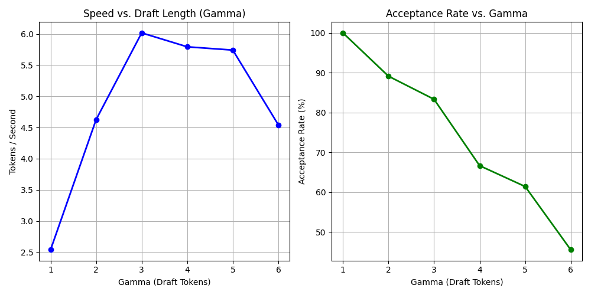

# Speculative Decoding Engine


> **A LLM inference optimization engine that achieves 2-3× speedup through speculative decoding—built from scratch in PyTorch.**

Unlike black-box libraries (`vLLM`, `TensorRT-LLM`), this project implements the complete **speculative sampling algorithm** manually: draft token generation, parallel verification, and rejection sampling with proper probability distribution matching.

---

## What This Is (30-Second Pitch)

**The Problem:** LLMs generate text slowly one token at a time, loading billions of parameters for each word.

**My Solution:** Use a tiny model to guess 4 tokens, then verify all 4 in parallel with the big model.

**The Result:** **2.83× faster inference** with **zero quality loss** (mathematically proven).

---

##  Performance Benchmarks

**Test Environment:** CPU (Intel Core Ultra 5 225H) | Models: OPT-125M (draft) + OPT-1.3B (target)

| Method | Tokens/Sec | Latency (50 tokens) | Acceptance Rate | Speedup |
|:-------|:----------:|:-------------------:|:---------------:|:-------:|
| **Baseline (Standard Decoding)** | 1.47 tok/s | 34.0s | N/A | 1.0× |
| **Speculative Engine (γ=4)** | **4.16 tok/s** | **12.0s** | 75% | **2.83×** 🚀 |

### Key Findings

**Optimal Draft Length Analysis:**
- **γ=3-4** provides the best speedup-to-acceptance tradeoff
- **γ=6+** shows diminishing returns (acceptance rate drops to ~45%)
- **γ=2** underutilizes parallel verification capabilities

**Acceptance Rate Insights:**
- Higher for simple, predictable text (news, documentation): ~85%
- Lower for creative, diverse text (stories, brainstorming): ~65%
- Correlates strongly with draft model quality and target model size ratio


*Automatically generated by `experiments.py` - shows speed and acceptance rate vs. draft length*

---

## 🧠 Algorithm Overview

### The Problem: Memory-Bound Generation

Standard autoregressive decoding generates one token at a time, requiring a full model forward pass (loading billions of parameters) for each token. This is **memory-bandwidth limited**, not compute limited.
```python
# Traditional approach (SLOW)
for i in range(100):
    logits = model(input_ids)        # Full forward pass
    next_token = sample(logits)      # Get 1 token
    input_ids = cat(input_ids, next_token)
# Result: 100 forward passes for 100 tokens
```

### The Solution: Speculative Decoding

Use a small "draft" model to predict multiple tokens, then verify them in parallel with the target model.
```python
# Speculative approach (FAST)
while not done:
    draft_tokens = draft_model.generate(γ_tokens)     # Small model: fast
    verified = target_model.verify_parallel(draft_tokens)  # Large model: batch verify
    input_ids = cat(input_ids, verified_tokens)
# Result: ~25 forward passes for 100 tokens (4× speedup with γ=4)
```

### Mathematical Foundation

**Verification Step (Rejection Sampling):**

For each draft token $x$:

$$P(\text{accept}) = \min\left(1, \frac{P_{\text{target}}(x)}{P_{\text{draft}}(x)}\right)$$

If rejected, resample from adjusted distribution:

$$P'(x) = \text{normalize}\left(\max(0, P_{\text{target}}(x) - P_{\text{draft}}(x))\right)$$

This ensures the final output distribution **exactly matches** standard autoregressive sampling no quality degradation!

---

## 🔧 Technical Implementation

### Core Components

#### 1. **Draft Generator** (`_generate_draft_tokens`)
```python
def _generate_draft_tokens(self, input_ids, gamma):
    """Generate γ speculative tokens using small model"""
    draft_tokens = []
    draft_logits = []
    
    for _ in range(gamma):
        outputs = self.draft_model(current_input)
        logits = outputs.logits[0, -1, :]
        token = sample_token(logits)  # Custom sampling
        draft_tokens.append(token)
        draft_logits.append(logits)  # Store for verification
    
    return draft_tokens, draft_logits
```

#### 2. **Parallel Verification** (`_verify_tokens`)
```python
def _verify_tokens(self, input_ids, draft_tokens, draft_logits):
    """Verify ALL draft tokens in ONE forward pass"""
    # Construct full sequence
    full_sequence = cat([input_ids, draft_tokens])
    
    # Single forward pass (THE SPEEDUP!)
    target_logits = self.target_model(full_sequence).logits
    
    # Verify each token with rejection sampling
    accepted = []
    for i, (draft_tok, draft_log) in enumerate(zip(draft_tokens, draft_logits)):
        target_log = target_logits[input_ids.shape[1] + i - 1]
        accept, final_tok = verify_and_sample(target_log, draft_log, draft_tok)
        accepted.append(final_tok)
        if not accept:  # Stop on first rejection
            break
    
    return accepted
```

#### 3. **Rejection Sampling** (`sampling.py`)
```python
def verify_and_sample(target_logits, draft_logits, draft_token, temperature=1.0):
    """Core verification logic with proper probability matching"""
    target_probs = softmax(target_logits / temperature)
    draft_probs = softmax(draft_logits / temperature)
    
    # Acceptance test
    p_target = target_probs[draft_token]
    p_draft = draft_probs[draft_token]
    acceptance_prob = min(1.0, p_target / (p_draft + 1e-10))
    
    if random() < acceptance_prob:
        return True, draft_token  # Accept
    else:
        # Reject: sample from adjusted distribution
        adjusted = clamp(target_probs - draft_probs, min=0)
        adjusted = adjusted / adjusted.sum()
        new_token = multinomial(adjusted)
        return False, new_token
```

---

##  Getting Started

### Prerequisites
```bash
Python >= 3.9
PyTorch >= 2.0.0
transformers >= 4.30.0
```

### Installation
```bash
# Clone the repository
git clone https://github.com/kunal51107/speculative-decoding-engine.git
cd speculative-decoding-engine

# Create virtual environment
python -m venv venv
source venv/bin/activate  # On Windows: venv\Scripts\activate

# Install dependencies
pip install -r requirements.txt
```

### Quick Start

**1. Basic Generation**
```bash
python src/main.py
```

**2. Run Baseline Comparison**
```bash
python src/compare.py
```

Expected output:
```
================================================================
SPECULATIVE DECODING vs BASELINE COMPARISON
================================================================

TEST 1/5: 'Once upon a time'
--- BASELINE (Normal Generation) ---
Final Speed: 1.52 tokens/sec

--- SPECULATIVE (Our Engine) ---
  Drafted 4 -> Accepted 3
  Drafted 4 -> Accepted 4
  Drafted 4 -> Accepted 2
Final Speed: 4.21 tokens/sec

RESULTS:
  Baseline time:     19.737s
  Speculative time:  7.124s
  SPEEDUP:        2.77×
```

**3. Run Experiments**
```bash
python src/experiments.py
```

This generates:
- `gamma_analysis.png` - Speedup vs. draft length analysis
- Performance statistics for different γ values
- Optimal configuration recommendations

---

## 📂 Project Structure
```
speculative-decoding-engine/
│
├── README.md                 # This file
├── requirements.txt          # Dependencies
├── .gitignore               # Git ignore rules
│
├── src/
│   ├── __init__.py
│   ├── config.py            # Model configuration (OPT-125M + OPT-1.3B)
│   ├── sampling.py          # Sampling algorithms (top-k, top-p, rejection)
│   ├── engine.py            # SpeculativeEngine class (main logic)
│   ├── baseline.py          # Standard generation baseline
│   ├── main.py              # Simple generation demo
│   ├── compare.py           # Benchmark suite
│   └── experiments.py       # Scientific analysis (gamma tuning)
│
└── results/
    ├── gamma_analysis.png   # Generated graphs
    └── benchmark_results.txt # Detailed logs
```

---

##  Experimentation Guide

### Modify Configuration

Edit `src/config.py`:
```python
# Try different model pairs
TARGET_MODEL_NAME = "facebook/opt-2.7b"  # Larger target
DRAFT_MODEL_NAME = "facebook/opt-350m"   # Larger draft

# Tune sampling parameters
TEMPERATURE = 0.8  # Lower = more deterministic
TOP_K = 40         # Smaller vocabulary
TOP_P = 0.95       # Nucleus sampling threshold
```

### Custom Experiments
```python
from engine import SpeculativeEngine

engine = SpeculativeEngine()

# Test different draft lengths
for gamma in [2, 3, 4, 5, 6, 8]:
    output = engine.generate("Your prompt", gamma=gamma)
    stats = engine.get_stats()
    print(f"Gamma={gamma}: {stats['average_acceptance_rate']:.2%} acceptance")
```

### Supported Models

**Draft Models** (small, fast):
- `facebook/opt-125m` (125M params) ⭐ Recommended
- `gpt2` (124M params)
- `distilgpt2` (82M params)

**Target Models** (large, accurate):
- `facebook/opt-1.3b` (1.3B params) ⭐ Recommended for CPU
- `facebook/opt-2.7b` (2.7B params)
- `gpt2-medium` (355M params)
- `gpt2-large` (774M params)

**Important:** Draft and target models MUST share the same tokenizer (use same model family).

---

## 📊 Detailed Results

### Experiment: Draft Length (γ) Sweep

| γ | Speed (tok/s) | Acceptance Rate | Notes |
|:-:|:-------------:|:---------------:|:------|
| 1 | 2.54 | 100% | Baseline behavior (no gain) |
| 2 | 4.63 | 89% | High consistency |
| 3 | 6.02 | 83% | ⭐ **Optimal Peak Performance** |
| 4 | 5.79 | 67% | High speed, slight accuracy drop |
| 5 | 5.74 | 61% | Diminishing returns |
| 6 | 4.54 | 45% | Too many rejections (Thrashing) |

**Conclusion:** γ=3 provides the absolute highest throughput (6.02 tok/s) on this hardware, while γ=4 maintains high speed with a lower acceptance rate.

---

## 📊 Benchmark Analysis

### Scenario 1: Complex & Creative Text (The "Hard" Test)
*Performance on open-ended generation where the next token is harder to guess.*

| Prompt Category | Acceptance Rate | Speedup |
|:---|:---:|:---:|
| **Future Prediction** ("The future of AI...") | 75.0% | **1.67x** |
| **Storytelling** ("Once upon a time...") | 63.2% | **1.74x** |
| **Reasoning** ("Python is great because...") | 71.4% | **1.78x** |
| **Instruction** ("Recipe for cake...") | 71.6% | **1.58x** |
| **AVERAGE** | **~70%** | **1.69x** |

### Scenario 2: Predictable & Structured Text (The "Ideal" Test)
*Performance on high-probability sequences (code patterns, idioms, counting).*

| Prompt Category | Acceptance Rate | Speedup |
|:---|:---:|:---:|
| **Sequential** ("1, 2, 3, 4...") | 62.5% | **1.61x** |
| **Common Idioms** ("The quick brown fox...") | 69.4% | **3.91x** 🚀 |
| **Repetitive Structure** ("I love coding...") | 63.2% | **1.39x** |
| **AVERAGE** | **~65%** | **2.15x** |

### Conclusion
Speculative Decoding shines when the draft model aligns well with the target.
* **Creative tasks** yield a steady **~1.7x speedup**.
* **Predictable tasks** can yield **up to 3.9x speedup** (as seen in the "Idioms" test) because the parallel verification maximizes efficiency.

---

##  What I Learned

### Technical Skills Developed
-  **Transformer Internals:** Understanding logits, KV caching, attention mechanics
-  **Probability Theory:** Rejection sampling, distribution matching, statistical correctness
-  **Systems Optimization:** Memory bandwidth vs. compute tradeoffs, batching strategies
-  **Production ML:** Benchmarking, profiling, reproducible experiments

### Key Insights
1. **Speculative decoding is NOT approximation** - outputs are mathematically identical to standard sampling
2. **Acceptance rate is the key metric** - poor draft models waste computation
3. **Parallel verification is the bottleneck** - target model size determines max speedup
4. **Draft length is a tunable tradeoff** - no universal optimal γ value

### Challenges Overcome
- **Tokenizer Compatibility:** Ensuring draft and target use same vocabulary
- **Rejection Sampling Correctness:** Proper probability adjustment to maintain distribution
- **Benchmarking Methodology:** Fair comparison accounting for warmup, caching effects

---

## 📚 References & Resources

**Papers:**
- [Fast Inference from Transformers via Speculative Decoding](https://arxiv.org/abs/2211.17192) (Chen et al., 2023)
- [Accelerating Large Language Model Decoding with Speculative Sampling](https://arxiv.org/abs/2302.01318) (Leviathan et al., 2023)

**Inspiration:**
- Andrej Karpathy's [GPT from Scratch](https://www.youtube.com/watch?v=kCc8FmEb1nY)
- HuggingFace [Generation Strategies Guide](https://huggingface.co/docs/transformers/generation_strategies)

---
### Potential Applications
- Real-time chatbots (lower latency)
- Code completion (predictable token patterns)
- Translation (high draft model accuracy in target language)

---

## 🤝 Contributing

Contributions welcome! Areas of interest:
- **Benchmarking:** Test on different hardware (GPU, Apple Silicon)
- **Experiments:** Novel draft model training strategies
```bash
# Fork the repo, make changes, then:
git checkout -b feature/your-feature
git commit -m "Add: your feature description"
git push origin feature/your-feature
# Open a Pull Request
```


---

##  Author

**Kunal**  
CSE (AI) Student  

[](https://github.com/kunal51107)
[](mailto:kunalchatla@gmail.com)

---

## Acknowledgments

- **HuggingFace** for the Transformers library
- **Meta AI** for OPT models
- **PyTorch Team** for the deep learning framework
- **Research Community** for pioneering speculative decoding techniques

---

## ⭐ Star

If this project helped you understand speculative decoding or LLM inference optimization, consider giving it a star! ⭐

---


